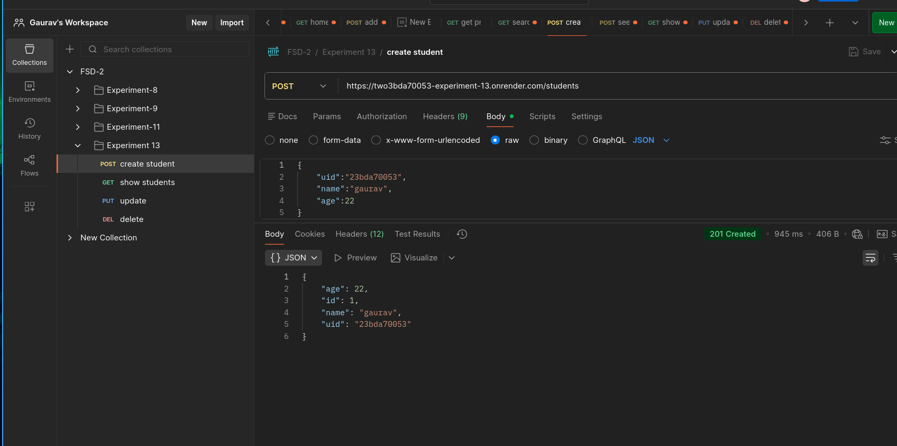
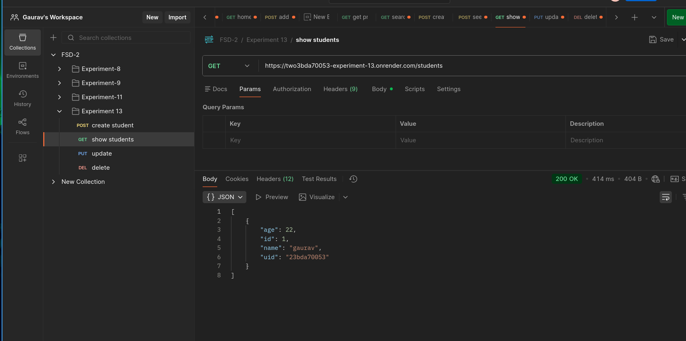
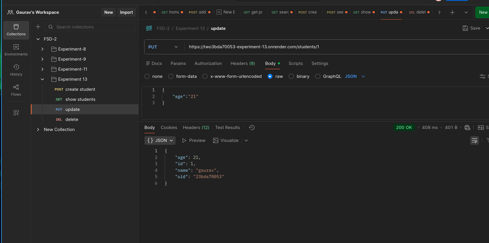
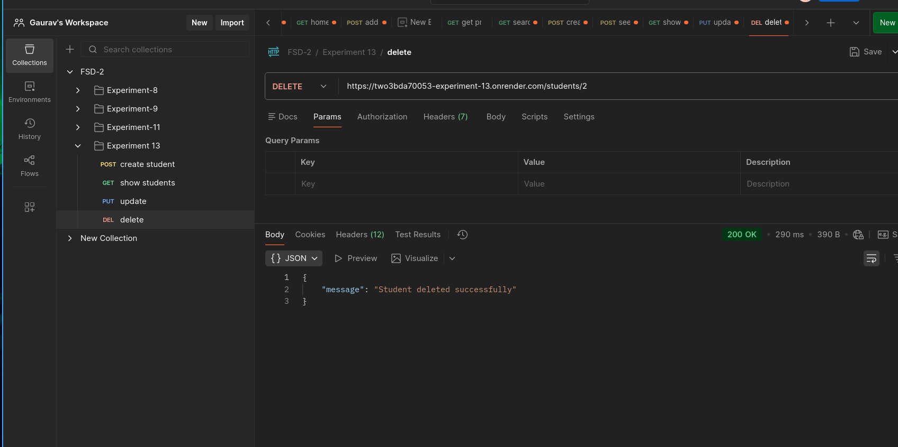

## 1. Aim

To connect a backend application with a database and perform CRUD (Create, Read, Update, Delete) operations along with input validation.

## 2. Tools & Technologies Used
Python
Flask
Flask-SQLAlchemy
MySQL (Aiven Cloud)
PyMySQL
Marshmallow
python-dotenv
Postman / Curl

## 3. Theory
# 3.1 REST API

A REST API enables communication between client and server using HTTP methods:

GET → Retrieve data
POST → Create data
PUT → Update data
DELETE → Remove data
# 3.2 ORM (Object Relational Mapping)

Flask-SQLAlchemy maps Python classes to database tables, eliminating the need to write raw SQL queries.

# 3.3 CRUD Operations
Create → Insert new records
Read → Fetch records
Update → Modify existing records
Delete → Remove records
3.4 Validation using Marshmallow

# Marshmallow is used to:

Ensure required fields are present
Validate data types
Apply constraints (e.g., age range, string length)
3.5 Cloud Database (Aiven)

The database is hosted on Aiven, which provides:

Remote database access
Secure connections using credentials
Scalability and reliability

## 4. API Endpoints

| No. | Endpoint           | Method | Description            | Request Body (Example) |
|-----|-------------------|--------|------------------------|------------------------|
| 1   | `/students`       | POST   | Create a new student   | `{ "uid": "U101", "name": "John", "age": 20 }` |
| 2   | `/students`       | GET    | Get all students       | Not Required |
| 3   | `/students/<id>`  | GET    | Get student by ID      | Not Required |
| 4   | `/students/<id>`  | PUT    | Update student         | `{ "name": "Updated Name" }` |
| 5   | `/students/<id>`  | DELETE | Delete student         | Not Required |
| 6   | `/`               | GET    | API status check       | Not Required |

## Learning Outcomes

1. Learned how to connect Flask backend with MySQL database
2. Understood ORM concepts using Flask-SQLAlchemy
3. Implemented RESTful APIs with proper HTTP methods
4. Gained hands-on experience with CRUD operations

## Screenshots
1.  `/students`       | POST   | Create a new student 

2.  `/students`       | GET    | Get all students    

3.  `/students/<id>`  | PUT    | Update student   
 
4.  `/students/<id>`  | DELETE | Delete student    
