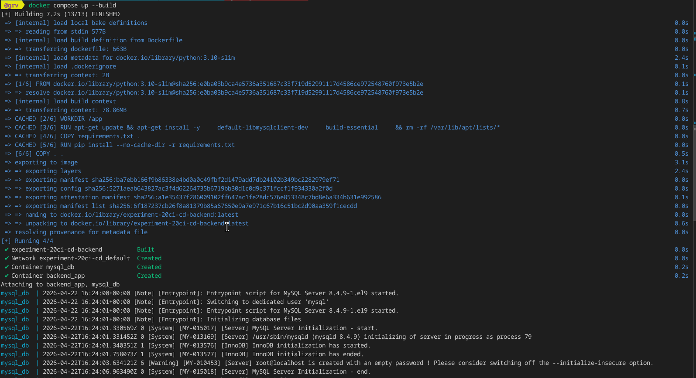
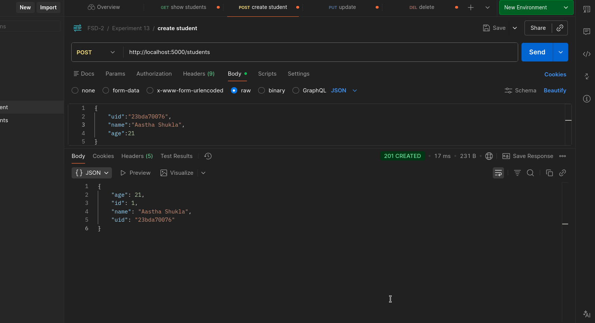
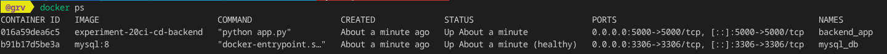

## 1. Aim

To integrate a Continuous Deployment (CD) pipeline into the existing Testing framework (Experiment-16), create a production-ready Docker image of a backend application, and automate the deployment workflow using GitHub Actions.

## 2. Theory
Continuous Integration & Continuous Deployment (CI/CD)

CI/CD is a method to frequently deliver apps to customers by introducing automation into the stages of app development.

    Continuous Integration (CI): Automates the process of merging code changes and running tests. It acts as a gatekeeper to ensure that new code doesn't break existing functionality.

    Continuous Deployment (CD): Automatically picks up the validated code from the CI stage, builds a production artifact (Docker Image), and pushes it to a registry or server.

Why Docker is Preferred for CI/CD

Docker is the industry standard for CI/CD pipelines because it offers Environment Parity—the environment where you test is identical to the environment where you deploy.

    Platform Independence: Docker containers wrap the application and all its dependencies (libraries, OS binaries, configurations) into a single package. This makes the application agnostic to the host OS. Whether the server runs Ubuntu, Fedora, or Alpine Linux, the container behaves exactly the same.

    Irrespective of Configuration: Traditionally, a server needed "pre-configuration" (installing Python, MySQL drivers, etc.). With Docker, the server only needs the Docker Engine. All specific configurations are "baked" into the image, eliminating the "it works on my machine" error.

    Isolation & Scalability: Each CI run happens in a fresh, isolated container. This prevents "state leakage" where data from a previous test run affects a new one.

## 3. Project Structure
Plaintext

backend/Experiment-13/
├── app.py              # Flask Application
├── requirements.txt    # Python Dependencies
├── tests/              # Pytest Suite
├── Dockerfile          # Production Build Instructions
├── docker-compose.yml  # Local & CI Orchestration
└── .github/workflows/  # CI/CD Pipeline Configuration

## 4. Implementation Details
Docker Configuration

The docker-compose.yml is configured to handle a MySQL database and the Flask backend. In the CI environment, we utilize depends_on with a service_healthy condition to ensure the database is ready before tests begin.
GitHub Actions Workflow

The workflow is triggered on a push to the main branch. It consists of two main phases:

    The Test Phase: Uses docker compose run --rm backend pytest. This creates a temporary container to run tests and then aborts/exits immediately so the pipeline can proceed.

    The Deployment Phase: Once tests pass, the docker/build-push-action builds a fresh production image and pushes it to Docker Hub.

## 5. How to Run
Local Development

To run the server locally:
Bash

docker compose up --build

Running Tests (CI Logic)

To simulate the CI test run:
Bash

docker compose run --rm backend pytest

## 6. Learning Outcomes

Automate Software Workflows: Design and implement a multi-stage pipeline using GitHub Actions.

Implement Environment Parity: Use Docker to ensure that the testing environment exactly matches the production environment.

Manage Container Lifecycle in CI: Use docker compose run to execute transient test processes that exit cleanly to allow pipeline progression.

Handle Secrets Management: Securely store and use sensitive credentials (Docker Hub tokens) within a CI/CD environment.

Apply Platform Independence: Package applications so they can be deployed on any host OS or hardware configuration without manual intervention.

## 7. Screenshots

1. Building docker image

2. Testing database endpoint

3. Running Containers

