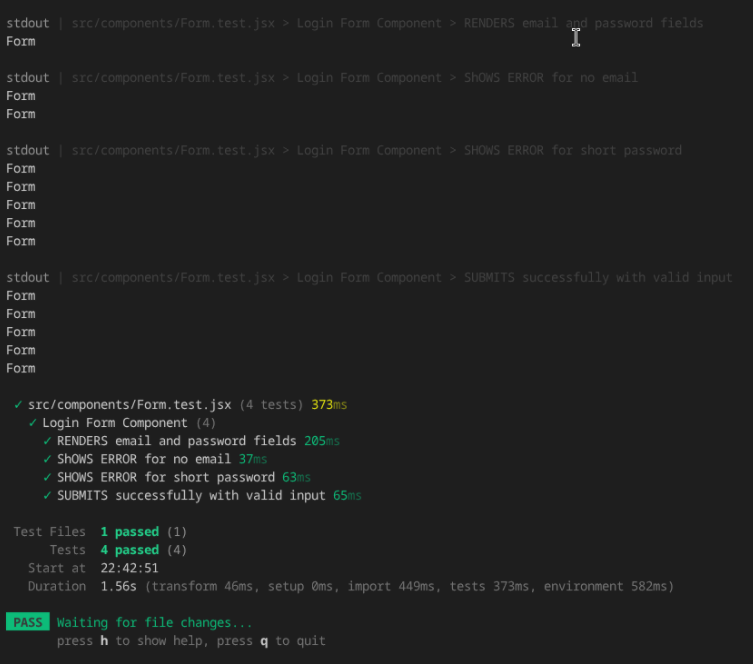
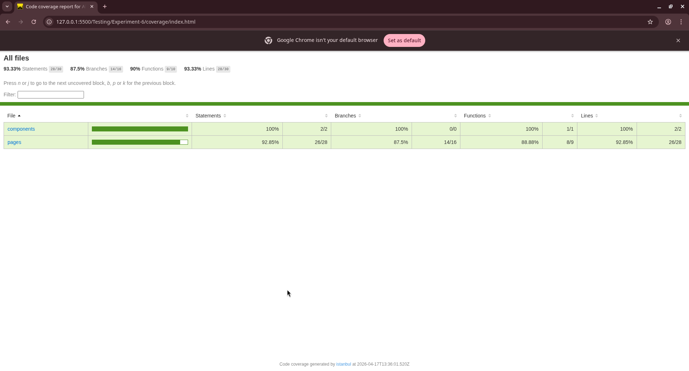
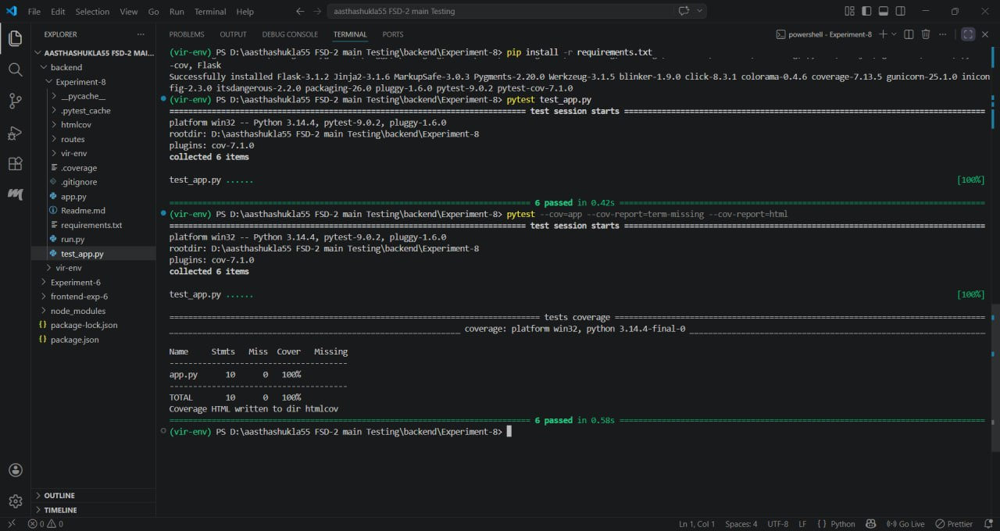
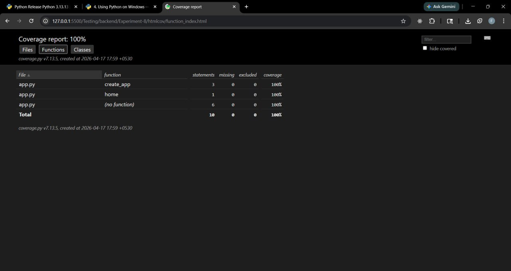

# Full-Stack Development: Flask API Testing & React MUI Implementation

## 1. Aim
To design and implement a robust full-stack feature set by developing a validated User Interface using **Material UI (MUI)** and ensuring backend reliability through **Pytest**-driven unit and integration testing.

---

## 2. Tools & Technologies

### Backend Testing
- **Language:** Python 3.10+
- **Framework:** Flask
- **Testing Tool:** `pytest` (Core framework)
- **Coverage Tool:** `pytest-cov` (Execution path analysis)
- **Environment:** `venv` (Dependency isolation)

### Frontend UI
- **Library:** React.js (via Vite)
- **UI Framework:** Material UI (MUI)
- **State Management:** React Hooks (useState)
- **Routing:** React Router DOM

---

## 3. Theory & Key Concepts

### Backend QA
* **Fixtures:** Reusable components (via `@pytest.fixture`) that initialize the Flask app in `TESTING` mode, providing a clean instance for every test.
* **Assertions:** Logical checks to verify that API responses (status codes, JSON payloads) match expected results.
* **Code Coverage:** A metric to measure the percentage of source code executed during testing to identify untested edge cases.

### Frontend Validation
* **Component-Based UI:** Using MUI to build accessible, Material Design-compliant forms.
* **Client-Side Validation:** * **Email Logic:** Ensuring data integrity by checking for the `@` symbol.
    * **Password Logic:** Enforcing a minimum length (6 characters) for basic security.
    * **Visual Feedback:** Utilizing `error` and `helperText` props to provide real-time user guidance.

---

## 4. Implementation Details

### Part A: RESTful API Test Suite
| Test Function | HTTP Method | Expected Status | Purpose |
| :--- | :--- | :--- | :--- |
| `test_home` | GET | 200 OK | Verifies the root health-check endpoint. |
| `test_create_student` | POST | 201 Created | Validates resource creation and JSON handling. |
| `test_get_students` | GET | 200 OK | Ensures the collection endpoint returns a list. |
| `test_update_student` | PUT | 200 OK | Tests state changes by modifying an existing resource. |
| `test_delete_student` | DELETE | 200 OK | Confirms resource removal and 404 handling. |

### Part B: React MUI Form
1.  **Project Setup:** Initialized with Vite; installed `@mui/material` and `@emotion/react`.
2.  **Architecture:** Organized `src/pages` with `Home.jsx`, `About.jsx`, and `Dashboard.jsx`.
3.  **UI Components:** Integrated `TextField`, `Checkbox`, and `Rating` into a unified form.
4.  **Submission Logic:** Configured `handleSubmit` to prevent data logging unless all validation criteria (Email/Password) are met.

---

## 5. Execution Commands

### Run Backend Tests
```bash
# Run all tests with verbose output
pytest -v

# Generate a coverage report in the terminal
pytest --cov=app --cov-report=term-missing

```

## 6. Learning Outcomes

    Environment Configuration: Mastered setting up Flask for testing environments and Vite for rapid frontend development.

    CRUD Validation: Gained hands-on experience in validating REST operations via automated scripts.

    State Management: Learned to handle multiple input types (Text, Checkbox, Rating) in a single React state object.

    Quality Assurance: Mastered the use of coverage reports to identify logic "blind spots," ensuring production-ready code.


## 7. Screenshots

Frontend Testing 



Frontend Coverage



Backend Testing



Backend coverage




